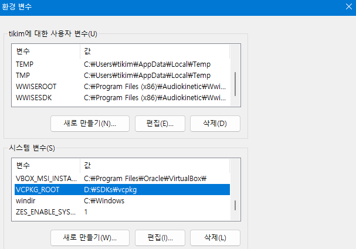

# cmake-vcpkg-poco-example

Example POCO project managed with CMake and vcpkg

> [!WARNING]  
> This repository has been discontinued.  
> If you want to find the better example, please check [[sappho192/POCOExercise](https://github.com/sappho192/POCOExercise)].  
> You can also create repository from the template [[sappho192/CppCMakeVcpkgTemplate](https://github.com/sappho192/CppCMakeVcpkgTemplate)].  

# How to build

## Setup vcpkg

### For Windows

1. Run following command in somewhere (e.a: D:\SDKs\)

```bash
git clone https://github.com/microsoft/vcpkg
.\vcpkg\bootstrap-vcpkg.bat
```

2. Add the path of vcpkg to system variable as `VCPKG_ROOT` like:



### For Unix(Linux)

1. Run following command in somewhere (e.a: `/home/your_id/sdk/`)

```bash
$ git clone https://github.com/microsoft/vcpkg
$ ./vcpkg/bootstrap-vcpkg.sh
```

2. Add the path of vcpkg to environment variable as `VCPKG_ROOT`.

## Setup VSCode and extensions

1. Install VSCode in your PC
2. In VSCode Extensions tab, install `CMake`, `Cmake Language Support`, and `CMake Tools`

## Build within VSCode

1. Load command palette (`ctrl+shift+p`) and run `CMake: Build`
2. Choose the subproject you want by clicking the project button in the bottom of the UI


# How to run

1. Choose the subproject you want by clicking the project button in the bottom of the UI
2. Run the subproject
